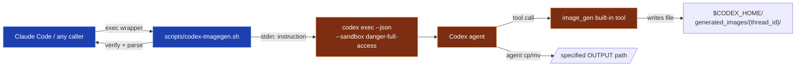

# `codex-imagegen` Backend

Generate images via Codex CLI's built-in `image_gen` tool from non-Codex runtimes (e.g., Claude Code). The wrapper spawns `codex exec --json` and lets the user's existing Codex subscription drive image generation — **no `OPENAI_API_KEY` required**.

This backend implements the `preferred_image_backend: codex-imagegen` config key already referenced in several `SKILL.md` files across this repo.

## Features

| Feature | Status |
|---------|--------|
| **Reliability**: retry + exponential backoff | Default 2 retries |
| **Verification**: confirms `image_gen` was actually invoked (not bypassed) | Checks `$CODEX_HOME/generated_images/{thread_id}/` |
| **Verification**: PNG magic-byte sanity check | ✓ |
| **Idempotency cache**: reuses output for same prompt+aspect+refs | `--cache-dir` |
| **Concurrency control**: file lock prevents parallel `codex exec` collisions | Built-in |
| **Structured logging**: JSONL log file | `--log-file` |
| **Token usage returned** | Embedded in result JSON |
| **`--ref` reference images** | Repeatable |
| **Unit tests** | 16 tests (parser / cache / validator) |
| **Error classification**: retryable vs non-retryable | 9 `error_kind` values |

## Why this backend

| Scenario | Conventional backend | This backend |
|----------|---------------------|--------------|
| You have a Codex subscription | OpenAI Images API costs add up per image | Subscription already covers it — zero marginal API cost |
| No `OPENAI_API_KEY` available | `baoyu-imagine` needs an API key | `codex login` is enough |
| Want to use GPT Image 2 | Only via OpenAI API | Codex's `image_gen` *is* GPT Image 2 |

## Prerequisites

```bash
npm install -g @openai/codex
codex login            # signs in with your OpenAI account (subscription)
codex --version        # confirm >= 0.130
```

`bun` is preferred for running the wrapper. On macOS:

```bash
brew install oven-sh/bun/bun
```

If `bun` is missing, the shell entrypoint falls back to `npx -y bun`.

## Usage

### Direct CLI

```bash
# Inline prompt
./scripts/codex-imagegen.sh \
  --image /tmp/cat.png \
  --prompt "A friendly orange cat, watercolor"

# Prompt from file
./scripts/codex-imagegen.sh \
  --image cover.png \
  --prompt-file prompts/01-cover.md \
  --aspect 16:9

# Verbose mode for debugging
./scripts/codex-imagegen.sh -v --image dog.png --prompt "A corgi" --aspect 1:1
```

On success, stdout emits a single JSON line:

```json
{"status":"ok","path":"/tmp/cat.png","bytes":2567101,"elapsed_seconds":53}
```

On failure, exit code is non-zero and stderr contains the error message.

### Enabling within image skills

Image-generating skills (e.g., `baoyu-cover-image`, `baoyu-article-illustrator`) already support a `preferred_image_backend` preference. To route them through this backend, set the following in the corresponding `EXTEND.md`:

```yaml
# ~/.baoyu-skills/baoyu-cover-image/EXTEND.md
preferred_image_backend: codex-imagegen
```

When the LLM runs the skill, it reads the preference and — guided by the `### codex-imagegen Backend` section in `CLAUDE.md` — invokes `scripts/codex-imagegen.sh`.

> **Note**: The integration is mediated by the LLM reading `CLAUDE.md`. It is not a hard binding. If a skill does not route to the backend automatically, mentioning it explicitly in the prompt works.

## Parameters

| Flag | Required | Description |
|------|----------|-------------|
| `--image <path>` | ✓ | Output PNG path (absolute recommended; relative paths are resolved against cwd) |
| `--prompt <text>` | one of | Prompt string (mutually exclusive with `--prompt-file`) |
| `--prompt-file <path>` | one of | Read prompt from file (mutually exclusive with `--prompt`) |
| `--aspect <ratio>` | | Aspect ratio. Default `1:1`. Common: `16:9`, `9:16`, `4:3`, `2.35:1` |
| `--ref <file>` | | Reference image path (repeatable) |
| `--timeout <ms>` | | `codex exec` timeout in ms. Default `300000` |
| `--retries <n>` | | Retry count on retryable errors. Default `2` (total attempts = retries + 1) |
| `--retry-delay <ms>` | | Base delay between retries (exponential backoff). Default `1500` |
| `--cache-dir <path>` | | Enable idempotency cache (reuses output for same prompt+aspect+refs) |
| `--log-file <path>` | | Structured JSONL log path (appended) |
| `-v` / `--verbose` | | Mirror log entries to stderr |
| `-h` / `--help` | | Show usage |

## Structured Output

On success, stdout contains a single JSON line:

```json
{
  "status": "ok",
  "path": "/tmp/owl.png",
  "bytes": 1693831,
  "elapsed_seconds": 87,
  "thread_id": "019e40e8-daef-7c60-943d-5e7bb3f6cb3d",
  "attempts": 1,
  "cached": false,
  "usage": {
    "input": 110899,
    "cached_input": 83456,
    "output": 457,
    "reasoning": 47
  },
  "tool_calls": [
    {"tool": "shell", "status": "completed"},
    {"tool": "agent_message", "status": "completed"}
  ]
}
```

Cache hits return with `elapsed_seconds: 0`, `cached: true`, `attempts: 0`.

On failure, exit code is `1` and the JSON contains `error` and `error_kind`:

```json
{
  "status": "error",
  "error": "image_gen was not invoked: no PNG in ...",
  "error_kind": "no_image_gen_tool_use"
}
```

## Error Kinds

| `error_kind` | Retryable | Meaning |
|--------------|-----------|---------|
| `codex_not_installed` | ✗ | `codex` CLI not found |
| `invalid_args` | ✗ | Argument parsing error |
| `prompt_file_missing` | ✗ | `--prompt-file` path does not exist |
| `spawn_failed` | ✓ | `codex exec` exited non-zero |
| `timeout` | ✓ | Exceeded `--timeout` |
| `no_image_gen_tool_use` | ✓ | Agent did not invoke `image_gen` (it took another path) |
| `output_missing` | ✓ | Output file not created |
| `invalid_png` | ✓ | Output is not a valid PNG |
| `agent_refused` | ✓ | No `thread_id` in event stream (Codex refused to respond) |
| `lock_busy` | ✗ | Concurrency lock acquisition timed out |

## Measured Performance

| Metric | Value |
|--------|-------|
| First-run latency | 50–90 s |
| Cache-hit latency | < 0.3 s |
| Output dimensions | 1024×1024, 1672×941 (16:9), etc. — chosen by `image_gen` |
| Output format | PNG (RGB, 8-bit) |
| Token usage per call | ~110k input (~80k cached) + ~500 output |
| Quota source | Codex subscription (does not consume OpenAI API quota) |
| Default timeout | 300 s (5 min) |

## Limitations & Risks

1. **5–10× slower than direct API**. `codex exec` cold-starts the agent, loads the built-in `image_gen` SKILL.md, and runs reasoning before invoking the tool. Cache hits avoid this for repeated prompts.
2. **ToS gray area**. Codex's `image_gen` tool is designed for interactive use. Invoking it programmatically via `codex exec` from an external agent is not explicitly addressed by current OpenAI policies. Suggested guardrails:
   - Personal, low-volume use is reasonable.
   - Not recommended for production automation or high-volume batch jobs.
   - Users are responsible for ensuring their usage complies with applicable terms of service.
3. **Sandbox permissions**. The wrapper passes `--sandbox danger-full-access` so the spawned agent can move the rendered PNG out of `$CODEX_HOME/generated_images/`. This is necessary because the agent must `cp`/`mv` the file to the user-specified output path.
4. **Concurrency = 1**. The file lock serializes concurrent invocations to avoid `codex exec` collisions. Parallel calls queue.

## Troubleshooting

| Symptom | `error_kind` | Resolution |
|---------|--------------|------------|
| `command not found: codex` | `codex_not_installed` | `npm install -g @openai/codex` |
| `codex exec` fails | `spawn_failed` | Check `codex login` status; inspect `raw_log` path |
| Timeout | `timeout` | Pass `--timeout 600000` (10 min) for slow networks |
| Agent skipped `image_gen` | `no_image_gen_tool_use` | Auto-retries; consider sharpening the prompt — abstract prompts let the agent wander |
| Output missing | `output_missing` | Agent did not `cp` to the target path; check `raw_log` for the actual save location under `generated_images/` |
| Lock held | `lock_busy` | Wait for the in-flight request to finish; or `rm ~/.cache/baoyu-codex-imagegen/codex-exec.lock` |
| Low image quality | — | Sharpen the prompt, try a different aspect, or supply `--ref` |

## Architecture

```
scripts/codex-imagegen.sh        # thin bash entrypoint
scripts/codex-imagegen/
├── main.ts        # parseArgs → cache → lock → retry loop → emit JSON
├── types.ts       # CliOptions, GenerateResult, GenError, ErrorKind
├── spawn.ts       # spawn codex exec --json --sandbox danger-full-access
├── parser.ts      # parse JSONL event stream → toolCalls, usage, thread_id
├── validator.ts   # verify image_gen invocation + PNG magic + file size
├── cache.ts       # cacheKey(sha256), FileLock, lookup/store
├── logger.ts      # JsonLogger (verbose stderr + JSONL file)
├── parser.test.ts
├── cache.test.ts
└── validator.test.ts
```

Run tests:

```bash
cd scripts/codex-imagegen && bun test
```

## Internal Flow



## Design Decisions

1. **Bash entrypoint + TypeScript implementation** — the shell wrapper picks the runtime (`bun` preferred, falling back to `npx -y bun`); TypeScript handles the orchestration, parsing, retry, cache, and logging. This mirrors the project's existing `scripts/*.mjs` and `skills/<skill>/scripts/main.ts` pattern.
2. **`--sandbox danger-full-access`** — necessary so the spawned agent can `cp`/`mv` the rendered PNG out of `$CODEX_HOME/generated_images/` to the user-specified path. Standard sandboxes block this.
3. **Parse the JSONL event stream** — the final `agent_message` and intermediate `command_execution` events let the wrapper verify what actually happened (was `image_gen` called? did `cp` reach the right destination?), which is far more reliable than scraping freeform stdout.
4. **Infrastructure, not a skill** — this backend is a CLI utility that skills route to via `preferred_image_backend`. It belongs in `scripts/`, not `skills/`, because it has no `SKILL.md` and is never loaded directly by an agent.
5. **File lock instead of internal queue** — keeps the implementation small and works across multiple shell sessions or processes invoking the same wrapper concurrently.

## Related Files

| File | Role |
|------|------|
| `scripts/codex-imagegen.sh` | CLI entrypoint |
| `scripts/codex-imagegen/` | TypeScript implementation |
| `docs/codex-imagegen-backend.md` | This document |
| `CLAUDE.md` | Tells LLMs how to invoke this backend |
| `.github/workflows/codex-imagegen-tests.yml` | CI unit tests |
